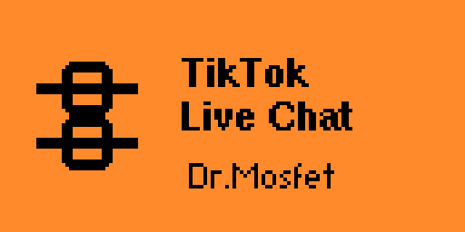
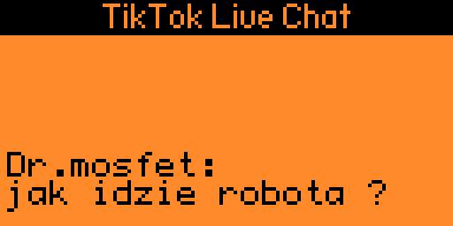

# TikTok Live Chat - Flipper Zero Display

## Real-time TikTok Live Chat Monitor for Flipper Zero

<div align="center">
    
    
    
</div>

Display your TikTok Live chat, gifts, and follows in real-time on your Flipper Zero via Bluetooth Low Energy (BLE). The Python server runs on your PC, connects to the TikTok Live stream, and forwards all events to the Flipper Zero wirelessly.

## Features Overview

**Live Events Display**

* **Chat comments:** Username and full message shown with word-wrap across multiple lines.
* **Gifts:** LED notification (red), no screen clutter.
* **Follows:** Shown on screen with blue LED indicator.
* **Likes:** Silent LED notification only.

**Smart Text Rendering**

* Automatic word-wrap based on screen math (128x64 px, FontKeyboard).
* Up to 6 lines of content visible at once.
* Scrollable message history (up to 8 messages stored).
* Separator lines between messages.

**Notifications**

* Green LED + beep on new chat message.
* Red LED on gift.
* Blue LED on follow.
* Backlight turns on automatically on new event.

**Python Server (GUI)**

* Tkinter GUI - no terminal needed.
* Optional EulerStream API key support for improved stream access.
* Checkbox to disable Flipper Zero — monitor TikTok chat without the device.
* Text-to-Speech (TTS) - reads chat aloud via Windows SAPI.
* Voice selection and speed control.
* Deduplication — no repeated messages within 3 seconds.
* 3-second backlog discard on connect.
* Auto-reconnect to Flipper Zero on disconnect.
* Keepalive packets every 15 seconds to prevent Flipper timeout.
* Auto-install of dependencies (TikTokLive, bleak) on first run.

**Connectivity**

* Bluetooth Low Energy (BLE) serial profile.
* 83-byte binary packets: type + username + message.
* Auto-discovery of Flipper Zero by BLE device name prefix.

## Installation Guide

**Prerequisites**

* Flipper Zero with f7 firmware
* TikTok account with an active Live stream to monitor
* Python 3.x installed on PC

**1. Compile and Install Flipper App**

Navigate to the flipperzero-firmware directory and compile:

```bash
./fbt COMPACT=1 DEBUG=0 launch APPSRC=applications_user/tiktok_live
```

Or manually copy the compiled `.fap` file from `build/f7-firmware-C/.extapps/tiktok_live.fap` to `/ext/apps/Bluetooth/` on your Flipper Zero.

**2. Run the Python Server**

```bash
python tiktok_server_gui.py
```

Dependencies (`TikTokLive`, `bleak`) are installed automatically on first run.

**3. Connect**

1. On Flipper: open **TikTok Live** app — it starts advertising as `TikTok XXXX`
2. In the Python GUI: enter the TikTok username (without `@`) and click **START**
3. The server scans for the Flipper, connects via BLE, then joins the live stream
4. Messages appear on the Flipper screen in real-time

## Usage Instructions

**On Flipper Zero:**

1. Navigate to: Apps -> Bluetooth -> TikTok Live
2. Splash screen shows for 2.5 seconds
3. Status shows "Waiting for connection..."
4. LED and beep on every new event

**On PC:**

1. Launch `tiktok_server_gui.py`
2. Enter TikTok username (without @)
3. Optionally enter EulerStream API key
4. Check or uncheck "Send to Flipper Zero" as needed
5. Click **START**

## Flipper Controls

| Button | Action |
|--------|--------|
| Up | Scroll to older messages |
| Down | Scroll to newer messages |
| OK | Jump to newest message |
| Back | Exit app |

## Message Types

| Prefix | Event |
|--------|-------|
| *(none)* | Chat comment |
| `[G]` | Gift |
| `[F]` | New follower |

## Data Flow

```
TikTok Servers
      |
      v  (TikTokLive Python lib)
tiktok_server_gui.py  <-- runs on your PC
      |
      v  (BLE / Bluetooth serial)
Flipper Zero  <-- tiktok_live FAP
```

## Technical Specifications

BLE Protocol (83-byte packet):

```c
#pragma pack(push, 1)
typedef struct {
    uint8_t type;              // 0=chat, 1=like, 2=gift, 3=follow
    char    username[17];      // null-terminated, max 16 chars
    char    message[65];       // null-terminated, max 64 chars
} TikTokMessage;
#pragma pack(pop)
```

BLE:

* Service UUID: `8fe5b3d5-2e7f-4a98-2a48-7acc60fe0000`
* RX UUID: `19ed82ae-ed21-4c9d-4145-228e62fe0000`
* Device name prefix: `TikTok`

Screen layout (128x64 px):

* Header bar: 10 px (white on black)
* Chat area: 53 px = 6 line slots x 8 px (FontKeyboard)
* Characters per line: 20 (123 px usable / 6 px per char)
* Scrollbar: 3 px right edge

Performance:

* Refresh rate: 100ms (10 Hz)
* Message buffer: 8 messages (circular)
* Stack size: 2 KB

## Troubleshooting

* **Flipper not found** - Ensure TikTok Live app is running on Flipper, check PC Bluetooth is enabled
* **TikTok connection error** - Try adding a free EulerStream API key at eulerstream.com
* **Messages not appearing** - Check that the username is correct and the stream is currently live
* **Garbled characters** - Non-ASCII characters (emoji, accented letters) are automatically transliterated or replaced with `?`

## Author

Dr.Mosfet - Created for the TikTok Live and Flipper Zero communities.

BLE Serial helper based on work by Willy-JL from [Xtreme-Apps](https://github.com/Flipper-XFW/Xtreme-Apps).

## License

MIT License - see LICENSE file for details.

